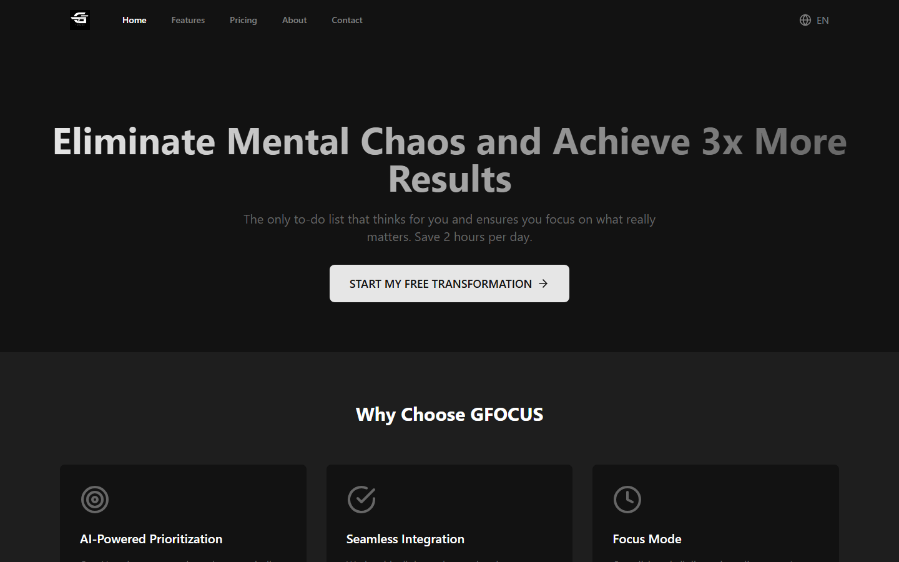

# 🎯 GFOCUS - Elimine o Caos Mental e Conquiste 3x Mais Resultados

<p align="center">
  <a href="https://github.com/guuszz/Gfocus/actions/workflows/ci.yml"></a>
</p>
<p align="center">
  <a href="https://gfocus-zeta.vercel.app"><b>🌐 Demo ao vivo</b></a>
</p>


<div align="center">
  
  
  
  
</div>
<p align="center">
  
</p>


<br>

> **A única lista de tarefas que pensa por você e garante que você foque no que realmente importa. Economize 2 horas por dia.**

## 📋 Sobre o Projeto

GFOCUS é uma aplicação moderna de gerenciamento de tarefas que combina inteligência artificial com design intuitivo para maximizar sua produtividade. Desenvolvida com React, TypeScript e tecnologias modernas, oferece uma experiência única de organização pessoal e profissional.

### 🎯 Problema que Resolve
- **Caos mental** causado por múltiplas tarefas
- **Procrastinação** por falta de priorização clara
- **Perda de foco** devido a distrações
- **Ineficiência** no gerenciamento de tempo

### ✨ Solução
- **IA-Powered Prioritization**: Análise inteligente de tarefas
- **Focus Mode**: Eliminação de distrações
- **Seamless Integration**: Integração com ferramentas existentes
- **Interface Intuitiva**: Design moderno e responsivo

## 🚀 Funcionalidades Principais

### 📱 Dashboard Inteligente
- **Drag & Drop**: Reorganize tarefas com arrastar e soltar
- **Filtros Avançados**: Visualize por status, data, categoria
- **Priorização Automática**: IA sugere o que fazer primeiro
- **Modo Foco**: Elimine distrações com um clique

### 🎨 Interface Moderna
- **Design Responsivo**: Funciona em desktop, tablet e mobile
- **Tema Escuro**: Interface elegante e moderna
- **Animações Suaves**: Experiência fluida e agradável
- **Multilíngue**: Suporte para português e inglês

### 📊 Analytics e Insights
- **Estatísticas Detalhadas**: Acompanhe seu progresso
- **Relatórios de Produtividade**: Visualize seus resultados
- **Métricas de Foco**: Monitore seu tempo de concentração

## 🛠️ Tecnologias Utilizadas

### Frontend
- **React 18.3.1** - Biblioteca principal para interface
- **TypeScript 5.5.3** - Tipagem estática e melhor DX
- **Vite 5.4.2** - Build tool rápido e moderno
- **Tailwind CSS 3.4.1** - Framework CSS utilitário

### Bibliotecas Principais
- **React Router DOM 6.22.3** - Roteamento da aplicação
- **Zustand 4.5.2** - Gerenciamento de estado
- **@dnd-kit** - Drag and drop funcional
- **Lucide React** - Ícones modernos
- **Date-fns** - Manipulação de datas

### Ferramentas de Desenvolvimento
- **ESLint** - Linting de código
- **PostCSS** - Processamento CSS
- **Autoprefixer** - Compatibilidade de navegadores

## �� Instalação e Uso

### Pré-requisitos
- Node.js 16+ 
- npm ou yarn

### Passos para Instalação

1. **Clone o repositório**
```bash
git clone https://github.com/guuszz/Gfocus.git
cd Gfocus
```

2. **Instale as dependências**
```bash
npm install
```

3. **Execute em modo de desenvolvimento**
```bash
npm run dev
```

4. **Acesse a aplicação**
```
http://localhost:5173
```

### Scripts Disponíveis

```bash
npm run dev          # Inicia servidor de desenvolvimento
npm run build        # Gera build de produção
npm run preview      # Visualiza build de produção
npm run lint         # Executa linting do código
```

## 🎨 Estrutura do Projeto

```
src/
├── components/          # Componentes reutilizáveis
│   ├── TaskCard.tsx     # Card de tarefa individual
│   ├── TaskForm.tsx     # Formulário de criação/edição
│   ├── Sidebar.tsx      # Barra lateral com filtros
│   └── ...
├── pages/              # Páginas da aplicação
│   ├── Dashboard.tsx   # Página principal
│   ├── Landing.tsx     # Página inicial
│   └── ...
├── store/              # Gerenciamento de estado
│   └── taskStore.ts    # Store de tarefas (Zustand)
├── contexts/           # Contextos React
│   └── LanguageContext.tsx
├── hooks/              # Custom hooks
├── types/              # Definições TypeScript
└── i18n/               # Internacionalização
```

## 🌟 Destaques Técnicos

### 🎯 Arquitetura Moderna
- **Componentes Funcionais** com hooks
- **TypeScript** para type safety
- **Zustand** para gerenciamento de estado simples
- **React Router** para navegação SPA

### 🎨 Design System
- **Tailwind CSS** para estilização
- **Design responsivo** mobile-first
- **Tema escuro** por padrão
- **Componentes reutilizáveis**

### 🔧 Performance
- **Vite** para build rápido
- **Code splitting** automático
- **Lazy loading** de componentes
- **Otimizações de bundle**

## 📱 Funcionalidades por Página

### 🏠 Landing Page
- Apresentação do produto
- Seção de features
- Testimonials
- Call-to-action

### 📊 Dashboard
- Lista de tarefas com drag & drop
- Filtros por status, data, categoria
- Formulário de criação/edição
- Sidebar com navegação

### 💰 Pricing
- Planos gratuitos e premium
- Comparação de features
- FAQ integrado

### 📄 About & Contact
- Informações sobre o produto
- Formulário de contato
- Horários de atendimento

## 🚀 Deploy

### Vercel (Recomendado)
```bash
npm run build
# Conecte com Vercel e faça deploy automático
```

### Netlify
```bash
npm run build
# Upload da pasta dist/
```

### GitHub Pages
```bash
npm run build
# Configure GitHub Pages para servir dist/
```

## 🤝 Contribuição

1. Fork o projeto
2. Crie uma branch para sua feature (`git checkout -b feature/AmazingFeature`)
3. Commit suas mudanças (`git commit -m 'Add some AmazingFeature'`)
4. Push para a branch (`git push origin feature/AmazingFeature`)
5. Abra um Pull Request

## 📄 Licença

Este projeto está sob a licença MIT. Veja o arquivo [LICENSE](LICENSE) para mais detalhes.

## 👨‍💻 Autor

**Gustavo** - gustavosaraiva2504@gmail.com -  [GitHub](https://github.com/guuszz)

## 🙏 Agradecimentos

- Comunidade React
- Tailwind CSS
- Vite
- Todos os contribuidores

---

<div align="center">
  <p>Feito com ❤️ e ☕</p>
  <p>⭐ Se este projeto te ajudou, considere dar uma estrela!</p>
</div>
